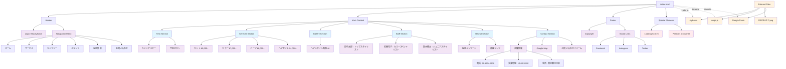

```mermaid
graph TD
    A[index.html] --> B[Header]
    A --> C[Main Content]
    A --> D[Footer]
    A --> E[Special Elements]
    
    B --> B1[Logo: BeautySalon]
    B --> B2[Navigation Menu]
    B2 --> B2a[ホーム]
    B2 --> B2b[サービス]
    B2 --> B2c[ギャラリー]
    B2 --> B2d[スタッフ]
    B2 --> B2e[採用情報]
    B2 --> B2f[お問い合わせ]
    
    C --> C1[Hero Section]
    C --> C2[Services Section]
    C --> C3[Gallery Section]
    C --> C4[Staff Section]
    C --> C5[Recruit Section]
    C --> C6[Contact Section]
    
    C1 --> C1a[キャッチコピー]
    C1 --> C1b[予約ボタン]
    
    C2 --> C2a[カット ¥5,000~]
    C2 --> C2b[カラー ¥7,000~]
    C2 --> C2c[パーマ ¥8,000~]
    C2 --> C2d[ヘアセット ¥4,000~]
    
    C3 --> C3a[ヘアスタイル画像 x6]
    
    C4 --> C4a[田中太郎 - トップスタイリスト]
    C4 --> C4b[佐藤花子 - カラースペシャリスト]
    C4 --> C4c[鈴木健太 - ジュニアスタイリスト]
    
    C5 --> C5a[採用メッセージ]
    C5 --> C5b[詳細リンク]
    
    C6 --> C6a[店舗情報]
    C6 --> C6b[Google Map]
    C6 --> C6c[お問い合わせフォーム]
    
    C6a --> C6a1[電話: 03-1234-5678]
    C6a --> C6a2[営業時間: 10:00-20:00]
    C6a --> C6a3[住所: 東京都〇〇区]
    
    D --> D1[Copyright]
    D --> D2[Social Links]
    D2 --> D2a[Facebook]
    D2 --> D2b[Instagram]
    D2 --> D2c[Twitter]
    
    E --> E1[Loading Screen]
    E --> E2[Particles Container]
    
    F[External Files] --> F1[style.css]
    F --> F2[script.js]
    F --> F3[RECRUIT-7.png]
    F --> F4[Google Fonts]
    
    A -.->|Links to| F1
    A -.->|Links to| F2
    A -.->|Links to| F4
    
    classDef section fill:#e1f5fe
    classDef subsection fill:#f3e5f5
    classDef external fill:#fff3e0
    classDef special fill:#ffebee
    
    class C1,C2,C3,C4,C5,C6 section
    class B1,B2,C1a,C1b,C2a,C2b,C2c,C2d,C3a,C4a,C4b,C4c,C5a,C5b,C6a,C6b,C6c,D1,D2 subsection
    class F,F1,F2,F3,F4 external
    class E1,E2 special
```